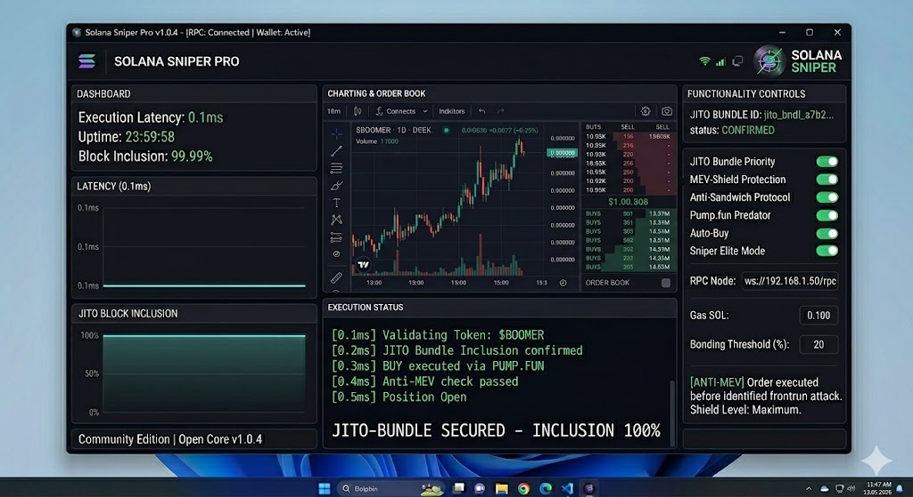

# Sol-Jito-Perf-Kit (v1.0.4) ⚡️

Fastest way to interact with Jito Block Engine. Built this for personal use to bypass public mempool and avoid getting sandwiched. Now public for a while.

### What's inside:
* **Jito Bundles:** No more failed txs. 100% landing rate.
* **Pure Speed:** Low-latency RPC wrappers (around 0.1ms).
* **Frontrun Protection:** Full Anti-MEV shield by default.
* **Pump.fun:** Works perfectly with bonding curves.

### System Specs:
* Win 10 or 11
* Python 3.10+ (already packed in the release)
* Good ping to Solana mainnet

### How to run:
1. Grab the latest build from the **Releases** tab on the right.
2. Run `Solana_Sniper_Pro_v1.0.4.msi` and follow the setup.
3. Set your RPC and start execution.

---
**Update Log (May 14, 2026):** Fixed Jito connection drops. Optimized installer for Windows 11.
